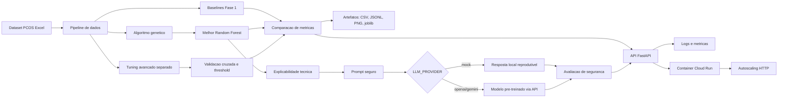

# Tech Challenge - Fase 2: Otimizacao Evolutiva e LLM para Diagnostico de SOP

Projeto da FIAP POSTECH - IA para Devs, desenvolvido como evolucao direta da Fase 1. A pasta da Fase 2 foi criada como copia isolada para preservar a entrega anterior e permitir uma implementacao mais estruturada.

## Projeto escolhido

**Projeto 1 - Algoritmos Geneticos e Modelos Generativos aplicados ao projeto da Fase 1.**

A solucao evolui o classificador de SOP da Fase 1 com:

- pipeline Python modular;
- algoritmo genetico para otimizacao de hiperparametros;
- comparacao contra baselines;
- explicabilidade por feature importance e permutation importance;
- explicacao em linguagem natural com LLM/mock seguro;
- logs e artefatos de experimento;
- documentacao de arquitetura cloud-ready.

## Como executar

Entre na pasta de codigo:

```bash
cd "Tech Challenge/Fase 2/code"
```

Instale as dependencias:

```bash
python -m venv .venv
source .venv/bin/activate
pip install -r requirements.txt
```

Reproduza os baselines:

```bash
python scripts/run_baseline.py
```

Execute os experimentos de algoritmo genetico:

```bash
python scripts/run_ga_experiments.py
```

Execute a etapa separada de investigacao e tuning avancado:

```bash
python scripts/run_advanced_tuning.py
```

Consolide resultados a partir dos logs JSONL:

```bash
python scripts/finalize_ga_results.py
```

Gere a explicacao em linguagem natural:

```bash
LLM_PROVIDER=mock python scripts/generate_llm_report.py
```

Para usar uma LLM real por API:

```bash
LLM_PROVIDER=openai LLM_API_KEY=sua_chave LLM_MODEL=gpt-4o-mini python scripts/generate_llm_report.py
```

Para usar Gemini API pelo Google AI Studio:

```bash
LLM_PROVIDER=gemini GEMINI_API_KEY=sua_chave LLM_MODEL=gemini-2.5-flash-lite python scripts/generate_llm_report.py
```

Execute a API local:

```bash
PYTHONPATH=src LLM_PROVIDER=mock python -m uvicorn pcos_fase2.api:app --host 0.0.0.0 --port 8000
```

Endpoints principais:

- `GET /health`: verifica se a API e o modelo estao disponiveis.
- `GET /features`: lista as features esperadas pelo modelo.
- `POST /predict`: retorna risco estimado de SOP.
- `POST /explain`: retorna a predicao e uma explicacao com LLM.
- `GET /metrics`: mostra contadores simples de uso, erros e latencia.

Para montar o payload de predicao, consulte primeiro a lista de features:

```bash
curl http://localhost:8000/features
```

O `POST /predict` deve conter todas as features retornadas em `GET /features`. A API recebe dados numericos ja no formato esperado pelo modelo, o que mantem a entrega simples e direta para demonstracao.

Execute os testes:

```bash
python -m pytest tests
```

## Resultados

Baselines reproduzidos:

| Modelo | Accuracy | Recall SOP | F1 SOP | AUC-ROC |
| --- | ---: | ---: | ---: | ---: |
| Regressao Logistica | 89.91% | 88.89% | 85.33% | 96.31% |
| Arvore de Decisao | 86.24% | 80.56% | 79.45% | 87.01% |
| Random Forest | 93.58% | 83.33% | 89.55% | 95.05% |
| KNN | 90.83% | 77.78% | 84.85% | 96.14% |

Melhor cromossomo encontrado na validacao do algoritmo genetico:

```json
{
  "class_weight": null,
  "max_depth": 32,
  "max_features": "log2",
  "min_samples_leaf": 2,
  "min_samples_split": 6,
  "n_estimators": 200
}
```

No teste final, o modelo otimizado atingiu accuracy de 92.66%, recall positivo de 83.33%, F1 positivo de 88.24% e AUC-ROC de 94.98%. O resultado nao supera o Random Forest baseline no teste, o que e uma discussao relevante para o relatorio: a busca evolutiva melhorou o desempenho em validacao, mas nao trouxe ganho real de generalizacao no conjunto de teste.

Como etapa adicional de investigacao, foi criado um fluxo separado de tuning avancado em `scripts/run_advanced_tuning.py`. Essa etapa testa duas abordagens:

- GA com validacao cruzada e objetivo de recall clinico;
- GA com objetivo balanceado;
- calibracao de threshold dos modelos baseline.

O melhor resultado dessa investigacao foi a calibracao do threshold do Random Forest para `0.60`, que superou o baseline original:

| Modelo | Accuracy | Precision SOP | Recall SOP | F1 SOP | AUC-ROC |
| --- | ---: | ---: | ---: | ---: | ---: |
| Random Forest baseline | 93.58% | 96.77% | 83.33% | 89.55% | 95.05% |
| Random Forest com threshold 0.60 | 94.50% | 100.00% | 83.33% | 90.91% | 95.05% |
| GA balanceado | 93.58% | 93.94% | 86.11% | 89.86% | 94.94% |

O ganho final veio mais da calibracao do ponto de corte do que de hiperparametros complexos. Isso e coerente com datasets pequenos: uma mudanca simples na regra de decisao pode generalizar melhor que uma busca muito agressiva de hiperparametros.

## Arquitetura



Para a parte de escalabilidade, a entrega inclui `Dockerfile` e `cloudrun-service.yaml`. O Cloud Run foi escolhido porque resolve o autoscaling de forma simples para uma API HTTP: escala para zero quando nao ha uso e aumenta instancias conforme chegam requisicoes.

## Artefatos principais

- `code/outputs/metrics/baseline_metrics.csv`
- `code/outputs/metrics/ga_history.csv`
- `code/outputs/metrics/model_comparison.csv`
- `code/outputs/metrics/advanced_tuning_comparison.csv`
- `code/outputs/metrics/advanced_tuning_history.csv`
- `code/outputs/metrics/advanced_threshold_sweep.csv`
- `code/outputs/metrics/feature_importance.csv`
- `code/outputs/models/best_model.joblib`
- `code/outputs/figures/fitness_evolution.png`
- `code/outputs/figures/confusion_matrix.png`
- `code/outputs/figures/roc_curve.png`
- `code/outputs/figures/feature_importance.png`
- `code/outputs/figures/advanced_tuning_fitness.png`
- `code/outputs/reports/llm_explanation.md`
- `code/Dockerfile`
- `code/cloudrun-service.yaml`

## Documentos

- `CONTEXTO_TECH_CHALLENGE_FASE2.md`: consolidado do enunciado e das aulas.
- `PLANO_IMPLEMENTACAO_FASE2.md`: plano tecnico da implementacao.
- `RELATORIO_TECNICO.md`: relatorio final da Fase 2.

## Checklist

- [x] Preservar a Fase 1 sem alteracoes.
- [x] Modularizar pipeline de dados e modelos.
- [x] Reproduzir baselines.
- [x] Implementar algoritmo genetico.
- [x] Executar tres experimentos.
- [x] Executar tuning avancado separado.
- [x] Gerar graficos e metricas.
- [x] Implementar explicacao com LLM/mock e providers reais via API.
- [x] Criar API de inferencia e explicacao.
- [x] Adicionar logging, metricas e configuracao cloud-ready.
- [x] Criar testes automatizados.
- [x] Atualizar relatorio tecnico.
