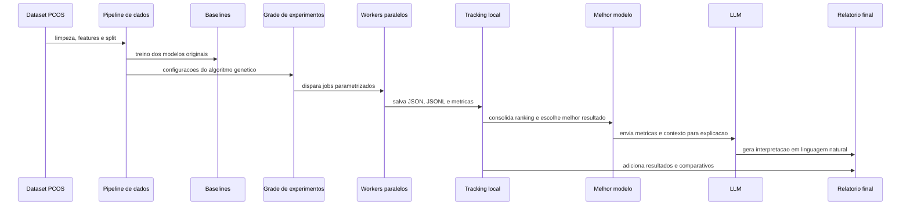

# Tech Challenge - Fase 2: Otimizacao Evolutiva e LLM para Diagnostico de SOP

Projeto da FIAP POSTECH - IA para Devs, desenvolvido como evolucao direta da Fase 1.

## Projeto escolhido

**Projeto 1 - Algoritmos Geneticos e Modelos Generativos aplicados ao projeto da Fase 1.**

A solucao evolui o classificador de SOP da Fase 1 com:

- pipeline Python modular;
- algoritmo genetico para otimizacao de hiperparametros;
- execucao de experimentos em formato de jobs;
- tracking de metricas, logs e artefatos;
- comparacao contra baselines;
- explicabilidade por feature importance e permutation importance;
- explicacao em linguagem natural com LLM/mock seguro e providers reais.

## Como executar

Entre na pasta de codigo:

```bash
cd "Tech Challenge/Fase 2/code"
```

Instale as dependencias:

```bash
python -m venv .venv
source .venv/bin/activate
pip install -r requirements.txt
```

Reproduza os baselines:

```bash
python scripts/run_baseline.py
```

Execute os experimentos principais de algoritmo genetico:

```bash
python scripts/run_ga_experiments.py
```

Execute um job parametrizado de GA:

```bash
python scripts/run_ga_job.py \
  --name job_validacao_individual \
  --population-size 6 \
  --generations 2 \
  --mutation-rate 0.1 \
  --crossover-rate 0.7
```

Execute uma grade de jobs em paralelo local:

```bash
python scripts/run_ga_experiment_grid.py --workers 2 --quick
python scripts/summarize_experiment_grid.py
```

Execute a etapa separada de investigacao e tuning avancado:

```bash
python scripts/run_advanced_tuning.py
```

Consolide resultados a partir dos logs JSONL:

```bash
python scripts/finalize_ga_results.py
```

Gere a explicacao em linguagem natural:

```bash
LLM_PROVIDER=mock python scripts/generate_llm_report.py
```

Para usar uma LLM real com OpenAI:

```bash
LLM_PROVIDER=openai LLM_API_KEY=sua_chave LLM_MODEL=gpt-4o-mini python scripts/generate_llm_report.py
```

Para usar Gemini pelo Google AI Studio:

```bash
LLM_PROVIDER=gemini GEMINI_API_KEY=sua_chave LLM_MODEL=gemini-2.5-flash-lite python scripts/generate_llm_report.py
```

Execute o fluxo completo em modo local:

```bash
python scripts/run_full_pipeline.py
```

Execute os testes:

```bash
python -m pytest tests
```

## Escalabilidade e tracking

O item de escalabilidade foi tratado como capacidade de executar treinamentos, testes e configuracoes de algoritmo genetico como jobs. Essa leitura segue o material de Desenvolvimento de ML na Cloud: scripts parametrizaveis, execucao de jobs, tracking de metricas e arquitetura que poderia ser levada para Azure ML, Vertex AI, SageMaker ou AutoML.

Nesta entrega, a simulacao e local e simples:

- cada job recebe parametros pela linha de comando;
- cada job salva um JSON com configuracao, tempo de execucao, melhor individuo, fitness, metricas e status;
- cada job salva logs JSONL por geracao;
- a consolidacao final gera CSV/JSON em `outputs/metrics`;
- a grade de experimentos usa workers paralelos locais para representar a ideia de execucao distribuida;
- o backend padrao usa threads por ser mais portavel; em ambientes sem restricao, `--backend process` tambem pode ser usado.

## Resultados

Baselines reproduzidos:

| Modelo | Accuracy | Recall SOP | F1 SOP | AUC-ROC |
| --- | ---: | ---: | ---: | ---: |
| Regressao Logistica | 89.91% | 88.89% | 85.33% | 96.31% |
| Arvore de Decisao | 86.24% | 80.56% | 79.45% | 87.01% |
| Random Forest | 93.58% | 83.33% | 89.55% | 95.05% |
| KNN | 90.83% | 77.78% | 84.85% | 96.14% |

Melhor cromossomo encontrado na validacao do algoritmo genetico:

```json
{
  "class_weight": null,
  "max_depth": 32,
  "max_features": "log2",
  "min_samples_leaf": 2,
  "min_samples_split": 6,
  "n_estimators": 200
}
```

No teste final, o modelo otimizado atingiu accuracy de 92.66%, recall positivo de 83.33%, F1 positivo de 88.24% e AUC-ROC de 94.98%. O resultado nao supera o Random Forest baseline no teste, o que e uma discussao relevante: a busca evolutiva melhorou validacao, mas nao trouxe ganho real de generalizacao no conjunto de teste.

Na investigacao adicional, o melhor resultado veio da calibracao do threshold do Random Forest para `0.60`:

| Modelo | Accuracy | Precision SOP | Recall SOP | F1 SOP | AUC-ROC |
| --- | ---: | ---: | ---: | ---: | ---: |
| Random Forest baseline | 93.58% | 96.77% | 83.33% | 89.55% | 95.05% |
| Random Forest com threshold 0.60 | 94.50% | 100.00% | 83.33% | 90.91% | 95.05% |
| GA balanceado | 93.58% | 93.94% | 86.11% | 89.86% | 94.94% |

## Arquitetura



## Artefatos principais

- `code/outputs/metrics/baseline_metrics.csv`
- `code/outputs/metrics/ga_history.csv`
- `code/outputs/metrics/model_comparison.csv`
- `code/outputs/metrics/ga_job_summary.csv`
- `code/outputs/metrics/ga_job_summary.json`
- `code/outputs/metrics/advanced_tuning_comparison.csv`
- `code/outputs/metrics/advanced_tuning_history.csv`
- `code/outputs/metrics/advanced_threshold_sweep.csv`
- `code/outputs/metrics/feature_importance.csv`
- `code/outputs/models/best_model.joblib`
- `code/outputs/figures/fitness_evolution.png`
- `code/outputs/figures/confusion_matrix.png`
- `code/outputs/figures/roc_curve.png`
- `code/outputs/figures/feature_importance.png`
- `code/outputs/figures/advanced_tuning_fitness.png`
- `code/outputs/reports/llm_explanation.md`

## Documentos

- `README.md`: execucao e resumo do projeto.
- `RELATORIO_TECNICO.md`: relatorio final da Fase 2.

## Checklist

- [x] Preservar a Fase 1 sem alteracoes.
- [x] Modularizar pipeline de dados e modelos.
- [x] Reproduzir baselines.
- [x] Implementar algoritmo genetico.
- [x] Executar tres experimentos.
- [x] Adicionar jobs parametrizados e grade paralela local.
- [x] Executar tuning avancado separado.
- [x] Gerar graficos, logs e metricas.
- [x] Implementar explicacao com LLM/mock e providers reais.
- [x] Criar testes automatizados.
- [x] Atualizar relatorio tecnico.
