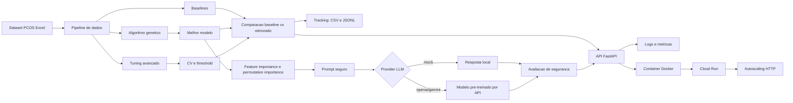

# Relatorio Tecnico - Tech Challenge Fase 2

**FIAP POSTECH - IA para Devs**
**Tema:** Otimizacao evolutiva e explicabilidade generativa para diagnostico assistido de SOP

## 1. Introducao

A Fase 2 evolui o projeto desenvolvido na Fase 1, cujo objetivo era criar um sistema de apoio ao diagnostico de Sindrome dos Ovarios Policisticos (SOP) usando modelos supervisionados. A proposta atual segue o Projeto 1 do Tech Challenge: otimizar modelos de diagnostico com algoritmos geneticos e integrar uma LLM para gerar explicacoes em linguagem natural.

O objetivo continua sendo triagem e apoio a decisao. O sistema nao substitui avaliacao medica, nao emite diagnostico definitivo e nao recomenda tratamento. Essa restricao e importante porque o dominio envolve saude, dados clinicos e risco de interpretacao indevida.

## 2. Dataset e baseline

Foi mantido o dataset PCOS usado na Fase 1, com 541 pacientes e variaveis clinicas, hormonais, sintomas e dados de ultrassom. A variavel alvo e `PCOS (Y/N)`, em que 1 representa paciente com SOP.

O pipeline herdado foi reproduzido em codigo modular:

- limpeza de identificadores e coluna vazia;
- conversao de colunas hormonais com tipos mistos;
- imputacao por mediana;
- codificacao de coluna textual;
- feature engineering clinico;
- selecao por correlacao;
- split estratificado;
- normalizacao com `StandardScaler`.

As features criadas na Fase 1 foram preservadas:

- `total_foliculos`;
- `soma_sintomas`;
- `faixa_imc`;
- `razao_lh_fsh`.

Resultados reproduzidos no conjunto de teste:

| Modelo | Accuracy | Precision SOP | Recall SOP | F1 SOP | AUC-ROC |
| --- | ---: | ---: | ---: | ---: | ---: |
| Regressao Logistica | 89.91% | 82.05% | 88.89% | 85.33% | 96.31% |
| Arvore de Decisao | 86.24% | 78.38% | 80.56% | 79.45% | 87.01% |
| Random Forest | 93.58% | 96.77% | 83.33% | 89.55% | 95.05% |
| KNN | 90.83% | 93.33% | 77.78% | 84.85% | 96.14% |

Como se trata de triagem medica, o recall da classe positiva continua sendo a metrica mais sensivel: falso negativo significa deixar de sinalizar uma paciente com possivel SOP.

## 3. Algoritmo genetico

O algoritmo genetico foi implementado de forma explicita, para demonstrar os conceitos das aulas:

- individuo: conjunto de hiperparametros do modelo;
- gene: um hiperparametro especifico;
- populacao: conjunto de configuracoes candidatas;
- fitness: qualidade da configuracao;
- selecao: torneio com `k=3`;
- crossover: uniforme por gene;
- mutacao: troca do valor dentro do dominio permitido;
- elitismo: preservacao dos melhores individuos;
- hotstart: inclusao de configuracao conhecida do baseline na populacao inicial.

O modelo otimizado foi o Random Forest, por ter sido o melhor baseline geral da Fase 1. Os genes usados foram:

| Gene | Dominio |
| --- | --- |
| `n_estimators` | 50, 100, 150, 200, 300, 500 |
| `max_depth` | None, 3, 5, 8, 12, 16, 24, 32 |
| `min_samples_split` | 2, 4, 6, 8, 10, 15, 20 |
| `min_samples_leaf` | 1, 2, 3, 4, 5, 8, 10 |
| `max_features` | sqrt, log2, None |
| `class_weight` | balanced, balanced_subsample, None |

A funcao de fitness priorizou recall, sem ignorar F1, AUC e acuracia:

```text
fitness = 0.50 * recall_pos
        + 0.30 * f1_pos
        + 0.15 * auc_roc
        + 0.05 * accuracy
        - penalidade_overfit
```

Essa escolha reflete o custo clinico maior do falso negativo.

## 4. Experimentos

Foram executadas tres configuracoes:

| Experimento | Populacao | Geracoes | Mutacao | Crossover | Objetivo |
| --- | ---: | ---: | ---: | ---: | --- |
| GA-Exploratorio | 20 | 20 | 0.25 | 0.80 | Explorar mais o espaco |
| GA-Balanceado | 30 | 30 | 0.15 | 0.75 | Equilibrar exploracao e refinamento |
| GA-Conservador | 20 | 40 | 0.08 | 0.65 | Refinar boas solucoes |

Melhor configuracao encontrada em validacao:

```json
{
  "class_weight": null,
  "max_depth": 32,
  "max_features": "log2",
  "min_samples_leaf": 2,
  "min_samples_split": 6,
  "n_estimators": 200
}
```

Na validacao interna do algoritmo genetico, essa configuracao atingiu:

- fitness: 0.9249;
- recall positivo: 91.43%;
- F1 positivo: 91.43%;
- AUC-ROC: 97.53%;
- accuracy: 94.44%.

No conjunto de teste final:

| Modelo | Accuracy | Precision SOP | Recall SOP | F1 SOP | AUC-ROC |
| --- | ---: | ---: | ---: | ---: | ---: |
| Random Forest baseline | 93.58% | 96.77% | 83.33% | 89.55% | 95.05% |
| Random Forest otimizado por GA | 92.66% | 93.75% | 83.33% | 88.24% | 94.98% |

O resultado mostra que o algoritmo genetico encontrou uma configuracao forte na validacao, mas ela nao superou o baseline no teste final. Isso e tecnicamente relevante: em datasets pequenos, a busca de hiperparametros pode se ajustar ao conjunto de validacao sem ganho real em teste. A conclusao correta e discutir esse comportamento como evidencia de necessidade de validacao adicional e controle de overfitting.

## 5. Investigacao adicional de tuning

Apos a primeira rodada do algoritmo genetico, foi criada uma etapa separada de investigacao para melhorar as metricas sem alterar o fluxo principal da Fase 2. O codigo dessa etapa fica em `scripts/run_advanced_tuning.py` e usa um modulo proprio, `pcos_fase2.advanced_tuning`.

Foram avaliadas tres ideias:

- GA com validacao cruzada estratificada, para reduzir dependencia de um unico split de validacao;
- GA com escolha entre Random Forest e Regressao Logistica;
- calibracao do threshold de decisao, em vez de usar sempre o corte padrao de `0.50`.

Essa decisao foi importante porque o problema e de triagem. O modelo pode ter boas probabilidades, mas a escolha do ponto de corte muda diretamente o equilibrio entre falso negativo, falso positivo, precision e recall.

Resultados no conjunto de teste:

| Modelo | Accuracy | Precision SOP | Recall SOP | F1 SOP | AUC-ROC |
| --- | ---: | ---: | ---: | ---: | ---: |
| Random Forest baseline | 93.58% | 96.77% | 83.33% | 89.55% | 95.05% |
| Random Forest com threshold 0.60 | 94.50% | 100.00% | 83.33% | 90.91% | 95.05% |
| GA com objetivo balanceado | 93.58% | 93.94% | 86.11% | 89.86% | 94.94% |
| GA com foco em recall clinico | 77.06% | 59.65% | 94.44% | 73.12% | 95.02% |

O melhor resultado geral foi a calibracao do threshold do Random Forest para `0.60`. Ela elevou a acuracia de 93.58% para 94.50% e o F1 positivo de 89.55% para 90.91%, mantendo o mesmo recall positivo de 83.33%. O GA balanceado tambem melhorou levemente o F1 em relacao ao Random Forest baseline, mas nao superou a calibracao de threshold.

O experimento focado em recall clinico atingiu 94.44% de recall positivo, mas derrubou precision e acuracia. Esse resultado e util para discussao: se o objetivo fosse uma triagem extremamente sensivel, ele poderia ser considerado, mas para a entrega final o trade-off ficou agressivo demais.

## 6. Explicabilidade e LLM

A explicabilidade foi dividida em duas camadas.

A primeira camada e tecnica:

- feature importance do Random Forest;
- permutation importance;
- matriz de confusao;
- curva ROC;
- metricas comparativas.

A segunda camada usa LLM para transformar os resultados em linguagem natural. A LLM nao recebe a tarefa de diagnosticar; ela apenas explica o resultado do modelo, com restricoes claras no prompt:

- nao fornecer diagnostico definitivo;
- nao prescrever tratamento;
- indicar que o resultado e apoio a triagem;
- reforcar que a decisao final e de profissional de saude;
- mencionar limitacoes e incertezas.

Foram implementados tres modos de execucao:

- `LLM_PROVIDER=mock`: modo padrao, local e reprodutivel, usado nos testes e na demonstracao sem chave externa;
- `LLM_PROVIDER=openai`: modo com provider real via API, usando `LLM_API_KEY` ou `OPENAI_API_KEY`.
- `LLM_PROVIDER=gemini`: modo com Gemini API, usando `GEMINI_API_KEY` ou `LLM_API_KEY`.

Tambem foi executada uma chamada real com Gemini API para validar o fluxo de ponta a ponta. A resposta gerada explicou um caso de paciente com baixa probabilidade estimada de SOP, destacou fatores clinicos relevantes, informou cautela com base nas metricas e reforcou que a decisao final deve ser tomada por profissional de saude. A checagem automatica de seguranca retornou:

```python
{
    "mentions_triage_support": True,
    "avoids_forbidden_terms": True,
    "mentions_professional": True,
}
```

O exemplo completo foi salvo em `code/outputs/reports/llm_explanation.md`.

Essa decisao esta alinhada ao que foi visto nas aulas: treinar LLM do zero nao e viavel para este contexto; usar modelo pre-treinado com prompt engineering, controle de seguranca e avaliacao da resposta e o caminho adequado.

## 7. API de inferencia

Para aproximar o projeto de uma entrega executavel, foi adicionada uma API simples com FastAPI. A ideia nao foi criar um sistema hospitalar completo, mas expor o modelo de forma clara para demonstracao e para uma futura implantacao.

A API possui quatro rotas principais:

| Rota | Objetivo |
| --- | --- |
| `GET /health` | Verifica se a API esta ativa e se o modelo foi carregado. |
| `GET /features` | Lista as features esperadas pelo modelo. |
| `POST /predict` | Recebe dados numericos do paciente e retorna probabilidade estimada de SOP. |
| `POST /explain` | Faz a predicao e gera uma explicacao com LLM. |
| `GET /metrics` | Mostra contadores simples de uso, erros e latencia. |

O contrato foi mantido propositalmente simples. A API recebe um JSON com as features numericas ja no formato usado pelo modelo:

```json
{
  "features": {
    " Age (yrs)": 28,
    "Weight (Kg)": 62
  }
}
```

Na chamada real, o payload deve conter todas as 31 features listadas por `GET /features`. Caso alguma feature esteja ausente ou exista uma feature extra, a API retorna erro de validacao. Essa escolha evita colocar regras clinicas e limpeza de planilha dentro da camada HTTP, mantendo a API focada em inferencia.

## 8. Monitoramento e arquitetura

O projeto registra:

- historico por geracao em JSONL;
- melhor fitness e fitness medio;
- diversidade da populacao;
- melhor cromossomo por geracao;
- metricas finais em CSV;
- resultados da investigacao de tuning avancado;
- varredura de thresholds;
- modelo final em `joblib`;
- graficos em PNG.
- logs de chamadas da API;
- contadores de requisicoes, erros, latencia media e predicoes por classe.

O monitoramento foi implementado de forma simples, em memoria, para atender ao objetivo academico sem adicionar banco de dados ou ferramentas externas. Em uma implantacao real, esses logs poderiam ser enviados para Cloud Logging, Datadog ou Prometheus.

Arquitetura alvo cloud-ready:



A configuracao cloud-ready foi feita com `Dockerfile` e `cloudrun-service.yaml`. O Cloud Run foi escolhido por ser uma forma direta de hospedar uma API HTTP com escalabilidade automatica: `minScale=0` reduz custo quando nao ha uso, e `maxScale=5` limita o crescimento para uma demonstracao controlada. As chaves de LLM nao ficam no repositorio; em um deploy real seriam configuradas como variaveis de ambiente ou secrets.

Em uma implantacao real, os experimentos de treinamento poderiam continuar como jobs independentes em Vertex AI, Azure ML ou SageMaker, enquanto a API ficaria responsavel apenas por inferencia e explicacao.

## 9. Testes

Foram criados testes automatizados para:

- preparacao dos dados e criacao das features;
- validade dos cromossomos;
- crossover e mutacao;
- funcao de fitness;
- funcoes auxiliares do tuning avancado;
- construcao do prompt;
- resposta mock da LLM;
- exigencia de chave no provider real;
- suporte a OpenAI e Gemini como providers reais;
- checagem de seguranca contra texto prescritivo.
- endpoints da API;
- validacao de payload de predicao;
- metricas basicas da API;
- explicacao via API usando provider mock.

Resultado da suite:

```text
18 passed
```

## 10. Limitacoes

As principais limitacoes permanecem:

- dataset pequeno, com 541 pacientes;
- origem geografica restrita;
- dados historicos, sem validacao prospectiva;
- risco de overfitting em otimizacao de hiperparametros;
- calibracao de threshold avaliada no mesmo teste final, exigindo validacao externa antes de uso real;
- dependencia de medidas de ultrassom;
- API sem autenticacao, adequada para demonstracao local, nao para producao;
- metricas em memoria, reiniciadas quando o processo reinicia;
- configuracao Cloud Run preparada, mas sem deploy real nesta entrega;
- LLM pode gerar texto inadequado se nao houver prompt e avaliacao de seguranca;
- o sistema e apoio a triagem, nao ferramenta de diagnostico autonomo.

## 11. Conclusao

A Fase 2 transformou o trabalho da Fase 1 em um projeto mais completo de experimentacao em IA. O algoritmo genetico foi implementado com os operadores estudados nas aulas e produziu uma configuracao competitiva. Na primeira rodada, o GA melhorou a validacao mas nao superou o melhor baseline no teste final, reforcando uma discussao importante em ciencia de dados: melhorar validacao nao garante ganho de generalizacao.

A investigacao adicional mostrou uma melhoria concreta: a calibracao do threshold do Random Forest superou o baseline em acuracia e F1 positivo. Esse resultado tambem melhora a narrativa tecnica do projeto, porque demonstra que a evolucao do modelo nao depende apenas de hiperparametros; a regra de decisao final tambem precisa ser calibrada de acordo com o objetivo clinico.

A integracao com LLM agregou valor na camada de interpretabilidade, desde que usada com restricoes claras e sem substituir julgamento medico. A API fechou a camada de entrega do modelo, com logs, metricas simples e configuracao para Cloud Run. Com isso, o projeto ficou mais reprodutivel, testavel e alinhado aos topicos da fase: algoritmos geneticos, PLN/LLMs, IA generativa, implantacao, logging, avaliacao e arquitetura preparada para cloud.
