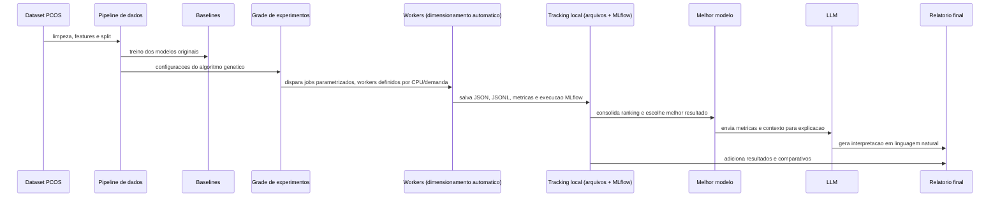

# Relatorio Tecnico - Tech Challenge Fase 2

**FIAP POSTECH - IA para Devs**  
**Tema:** Otimizacao evolutiva e explicabilidade generativa para diagnostico assistido de SOP

## 1. Introducao

A Fase 2 evolui o projeto desenvolvido na Fase 1, cujo objetivo era criar um sistema de apoio ao diagnostico de Sindrome dos Ovarios Policisticos (SOP) usando modelos supervisionados. A proposta atual segue o Projeto 1 do Tech Challenge: otimizar modelos de diagnostico com algoritmos geneticos e integrar uma LLM para gerar explicacoes em linguagem natural.

O objetivo continua sendo triagem e apoio a decisao. O sistema nao substitui avaliacao medica, nao emite diagnostico definitivo e nao recomenda tratamento. Essa restricao e importante porque o dominio envolve saude, dados clinicos e risco de interpretacao indevida.

## 2. Dataset e baseline

Foi mantido o dataset PCOS usado na Fase 1, com 541 pacientes e variaveis clinicas, hormonais, sintomas e dados de ultrassom. A variavel alvo e `PCOS (Y/N)`, em que 1 representa paciente com SOP.

O pipeline herdado foi reproduzido em codigo modular:

- limpeza de identificadores e coluna vazia;
- conversao de colunas hormonais com tipos mistos;
- imputacao por mediana;
- codificacao de coluna textual;
- feature engineering clinico;
- selecao por correlacao;
- split estratificado;
- normalizacao com `StandardScaler`.

As features criadas na Fase 1 foram preservadas:

- `total_foliculos`;
- `soma_sintomas`;
- `faixa_imc`;
- `razao_lh_fsh`.

Resultados reproduzidos no conjunto de teste:

| Modelo | Accuracy | Precision SOP | Recall SOP | F1 SOP | AUC-ROC |
| --- | ---: | ---: | ---: | ---: | ---: |
| Regressao Logistica | 89.91% | 82.05% | 88.89% | 85.33% | 96.31% |
| Arvore de Decisao | 86.24% | 78.38% | 80.56% | 79.45% | 87.01% |
| Random Forest | 93.58% | 96.77% | 83.33% | 89.55% | 95.05% |
| KNN | 90.83% | 93.33% | 77.78% | 84.85% | 96.14% |

Como se trata de triagem medica, o recall da classe positiva continua sendo a metrica mais sensivel: falso negativo significa deixar de sinalizar uma paciente com possivel SOP.

## 3. Algoritmo genetico

O algoritmo genetico foi implementado de forma explicita, para demonstrar os conceitos das aulas:

- individuo: conjunto de hiperparametros do modelo;
- gene: um hiperparametro especifico;
- populacao: conjunto de configuracoes candidatas;
- fitness: qualidade da configuracao;
- selecao: torneio com `k=3`;
- crossover: uniforme por gene;
- mutacao: troca do valor dentro do dominio permitido;
- elitismo: preservacao dos melhores individuos;
- hotstart: inclusao de configuracao conhecida do baseline na populacao inicial.

O modelo otimizado foi o Random Forest, por ter sido o melhor baseline geral da Fase 1. Os genes usados foram:

| Gene | Dominio |
| --- | --- |
| `n_estimators` | 50, 100, 150, 200, 300, 500 |
| `max_depth` | None, 3, 5, 8, 12, 16, 24, 32 |
| `min_samples_split` | 2, 4, 6, 8, 10, 15, 20 |
| `min_samples_leaf` | 1, 2, 3, 4, 5, 8, 10 |
| `max_features` | sqrt, log2, None |
| `class_weight` | balanced, balanced_subsample, None |

A funcao de fitness priorizou recall, sem ignorar F1, AUC e acuracia:

```text
fitness = 0.50 * recall_pos
        + 0.30 * f1_pos
        + 0.15 * auc_roc
        + 0.05 * accuracy
        - penalidade_overfit
```

Essa escolha reflete o custo clinico maior do falso negativo.

## 4. Experimentos principais

Foram executadas tres configuracoes:

| Experimento | Populacao | Geracoes | Mutacao | Crossover | Objetivo |
| --- | ---: | ---: | ---: | ---: | --- |
| GA-Exploratorio | 20 | 20 | 0.25 | 0.80 | Explorar mais o espaco |
| GA-Balanceado | 30 | 30 | 0.15 | 0.75 | Equilibrar exploracao e refinamento |
| GA-Conservador | 20 | 40 | 0.08 | 0.65 | Refinar boas solucoes |

Melhor configuracao encontrada em validacao:

```json
{
  "class_weight": null,
  "max_depth": 32,
  "max_features": "log2",
  "min_samples_leaf": 2,
  "min_samples_split": 6,
  "n_estimators": 200
}
```

Na validacao interna do algoritmo genetico, essa configuracao atingiu:

- fitness: 0.9249;
- recall positivo: 91.43%;
- F1 positivo: 91.43%;
- AUC-ROC: 97.53%;
- accuracy: 94.44%.

No conjunto de teste final:

| Modelo | Accuracy | Precision SOP | Recall SOP | F1 SOP | AUC-ROC |
| --- | ---: | ---: | ---: | ---: | ---: |
| Random Forest baseline | 93.58% | 96.77% | 83.33% | 89.55% | 95.05% |
| Random Forest otimizado por GA | 92.66% | 93.75% | 83.33% | 88.24% | 94.98% |

O resultado mostra que o algoritmo genetico encontrou uma configuracao forte na validacao, mas ela nao superou o baseline no teste final. Isso e tecnicamente relevante: em datasets pequenos, a busca de hiperparametros pode se ajustar ao conjunto de validacao sem ganho real em teste.

## 5. Escalabilidade de experimentos e tracking

O enunciado pede recursos de escalabilidade automatica para lidar com variacoes de demanda, alem de monitoramento e logging para tracking de desempenho. A interpretacao adotada para esses dois itens seguiu o material da disciplina de Desenvolvimento de ML na Cloud (repositorio `lucolivi/ml-cloud-materiais`), no qual a nocao de escalabilidade nao aparece como uma API HTTP de serving, e sim como execucao de jobs de treinamento e ajuste de hiperparametros: scripts parametrizaveis com `argparse`, jobs submetidos a um compute cluster e `sweep jobs` com `max_concurrent_trials` limitando o paralelismo conforme o numero de tentativas e a capacidade do cluster. Nesse contexto, demanda corresponde ao volume de jobs de treinamento e experimentacao, nao ao trafego de inferencia.

A implementacao local reproduz essa logica sem depender de nuvem:

- scripts parametrizaveis, como nos exemplos de treinamento do material de referencia;
- execucao de jobs independentes para diferentes configuracoes do algoritmo genetico;
- grade de experimentos em paralelo local, com dimensionamento automatico do numero de workers a partir da quantidade de jobs pendentes e dos nucleos de CPU disponiveis (`pcos_fase2.scaling.auto_worker_count`), em vez de um numero fixo definido manualmente. Essa logica reproduz, em escala local, o comportamento de um compute cluster que ajusta a quantidade de instancias ativas conforme a fila de jobs;
- tracking de metricas em arquivos JSON, JSONL e CSV, complementado por MLflow com backend em arquivo local (`code/mlruns/`), na mesma linha do uso de `mlflow.log_param`/`mlflow.log_metric` demonstrado no material de referencia. O registro das execucoes nao depende de nenhum servidor; a interface `mlflow ui` e usada apenas como visualizador local e opcional dos mesmos arquivos;
- logging de aplicacao com o modulo `logging` do Python, registrando inicio, fim e falhas de cada execucao em `outputs/logs/pipeline.log`.

Foram adicionados scripts especificos para esse fluxo:

| Script | Papel |
| --- | --- |
| `run_ga_job.py` | Executa um experimento de GA com parametros de linha de comando e registra o resultado no MLflow local. |
| `run_ga_experiment_grid.py` | Executa uma grade de jobs em paralelo local, com numero de workers definido automaticamente por padrao. |
| `summarize_experiment_grid.py` | Consolida os resultados dos jobs em CSV/JSON. |
| `run_full_pipeline.py` | Orquestra o fluxo completo da Fase 2. |

Cada job salva:

- configuracao usada;
- tempo de execucao;
- status;
- melhor individuo;
- melhor fitness;
- metricas de validacao;
- log JSONL por geracao;
- execucao correspondente no MLflow local, com parametros, metricas e o log JSONL como artefato.

## 6. Investigacao adicional de tuning

Apos a primeira rodada do algoritmo genetico, foi criada uma etapa separada de investigacao para melhorar as metricas sem alterar o fluxo principal. O codigo dessa etapa fica em `scripts/run_advanced_tuning.py` e usa o modulo `pcos_fase2.advanced_tuning`.

Foram avaliadas tres ideias:

- GA com validacao cruzada estratificada;
- GA com escolha entre Random Forest e Regressao Logistica;
- calibracao do threshold de decisao.

Resultados no conjunto de teste:

| Modelo | Accuracy | Precision SOP | Recall SOP | F1 SOP | AUC-ROC |
| --- | ---: | ---: | ---: | ---: | ---: |
| Random Forest baseline | 93.58% | 96.77% | 83.33% | 89.55% | 95.05% |
| Random Forest com threshold 0.60 | 94.50% | 100.00% | 83.33% | 90.91% | 95.05% |
| GA com objetivo balanceado | 93.58% | 93.94% | 86.11% | 89.86% | 94.94% |
| GA com foco em recall clinico | 77.06% | 59.65% | 94.44% | 73.12% | 95.02% |

O melhor resultado geral foi a calibracao do threshold do Random Forest para `0.60`. Ela elevou a acuracia de 93.58% para 94.50% e o F1 positivo de 89.55% para 90.91%, mantendo o mesmo recall positivo de 83.33%.

## 7. Explicabilidade e LLM

A explicabilidade foi dividida em duas camadas.

A primeira camada e tecnica:

- feature importance do Random Forest;
- permutation importance;
- matriz de confusao;
- curva ROC;
- metricas comparativas.

A segunda camada usa LLM para transformar os resultados em linguagem natural. A LLM nao recebe a tarefa de diagnosticar; ela apenas explica o resultado do modelo, com restricoes claras no prompt:

- nao fornecer diagnostico definitivo;
- nao prescrever tratamento;
- indicar que o resultado e apoio a triagem;
- reforcar que a decisao final e de profissional de saude;
- mencionar limitacoes e incertezas.

Foram implementados tres modos de execucao:

- `LLM_PROVIDER=mock`: modo padrao, local e reprodutivel;
- `LLM_PROVIDER=openai`: provider real com OpenAI;
- `LLM_PROVIDER=gemini`: provider real com Gemini.

Tambem foi executada uma chamada real com Gemini. A resposta explicou um caso de paciente com baixa probabilidade estimada de SOP, destacou fatores clinicos relevantes, informou cautela com base nas metricas e reforcou que a decisao final deve ser tomada por profissional de saude. A checagem automatica de seguranca retornou:

```python
{
    "mentions_triage_support": True,
    "avoids_forbidden_terms": True,
    "mentions_professional": True,
}
```

O exemplo completo foi salvo em `code/outputs/reports/llm_explanation.md`.

Alem da checagem de seguranca, foi implementada uma avaliacao de qualidade da explicacao (`evaluate_response_quality`), distinta da checagem de seguranca e voltada a verificar se a resposta e coerente com os dados enviados a LLM e com a estrutura pedida no prompt:

- consistencia numerica: a probabilidade prevista informada na requisicao aparece corretamente na resposta;
- cobertura das secoes pedidas no prompt: resumo clinico, fatores principais, limitacoes e recomendacao de uso seguro;
- ausencia de fatores inventados: pelo menos um dos fatores globais reais do modelo e mencionado na resposta.

Exemplos avaliados com esse criterio:

| Exemplo | Consistencia numerica | Cobertura das secoes | Menciona fatores reais |
| --- | :---: | :---: | :---: |
| Resposta mock (paciente de exemplo) | Sim | Sim | Sim |
| Resposta real via Gemini (paciente de exemplo) | Sim | Sim | Sim |
| Resposta truncada, sem secao de limitacoes (caso de controle negativo) | Sim | Nao | Sim |

O terceiro exemplo foi construido deliberadamente sem a secao de limitacoes para validar que o criterio de cobertura de secoes rejeita respostas incompletas.

## 8. Desafios enfrentados e solucoes implementadas

- **GA nao superou o baseline no teste final**: a configuracao encontrada pelo algoritmo genetico teve o melhor fitness na validacao interna, mas ficou abaixo do Random Forest baseline no conjunto de teste. Em vez de forcar uma configuracao vencedora, o resultado foi mantido e discutido como evidencia de ajuste a validacao sem ganho de generalizacao, tema relevante em bases pequenas como a usada neste projeto. A investigacao adicional de tuning (secao 6) buscou uma alternativa mais robusta, que veio da calibracao de threshold.
- **Interpretacao do requisito de escalabilidade automatica**: o enunciado nao especifica se a escalabilidade deveria ser tratada como serving ou como experimentacao/treinamento. A solucao adotada foi fundamentar a decisao no material de referencia da disciplina de ML na Cloud (secao 5), que trata escalabilidade como jobs de treinamento em paralelo, e implementar o dimensionamento automatico de workers, evitando um parametro fixo definido manualmente.
- **Ausencia de ferramenta de tracking dedicada**: a primeira versao do projeto usava apenas arquivos JSON/JSONL/CSV para tracking. Essa abordagem foi complementada com MLflow em modo local, alinhando o projeto a ferramenta usada no material de referencia sem introduzir dependencia de servidor ou de nuvem.
- **Avaliacao de qualidade da explicacao gerada por LLM**: a checagem inicial cobria apenas seguranca (ausencia de linguagem prescritiva). Foi adicionado um criterio de qualidade separado, descrito na secao 7, para verificar consistencia numerica e cobertura da estrutura pedida no prompt. A primeira versao desse criterio gerou falsos negativos na resposta real do Gemini: a probabilidade foi escrita com virgula decimal ("3,2%", formato correto em portugues) em vez de ponto, e os fatores do modelo foram traduzidos para termos clinicos em portugues ("contagem de foliculos", "crescimento de pelo") em vez de repetir o nome tecnico da coluna em ingles. O criterio foi ajustado para aceitar os dois formatos de separador decimal e para reconhecer sinonimos clinicos das colunas do dataset, evitando penalizar uma resposta que estava correta e apenas mais natural para o publico medico.
- **Uso de dataset pequeno em otimizacao de hiperparametros**: com 541 pacientes, ha risco de overfitting na busca evolutiva. A funcao de fitness (secao 3) inclui penalidade explicita para a diferenca entre metricas de treino e validacao, reduzindo esse risco sem eliminar a limitacao.

## 9. Arquitetura da solucao



O desenho reproduz localmente o padrao de execucao de jobs parametrizados e tracking apresentado no material de referencia da disciplina de ML na Cloud (secao 5), com toda a execucao mantida neste ambiente local, sem provisionamento de infraestrutura externa.

## 10. Testes

Foram criados testes automatizados para:

- preparacao dos dados e criacao das features;
- validade dos cromossomos;
- crossover e mutacao;
- funcao de fitness;
- funcoes auxiliares do tuning avancado;
- construcao do prompt;
- resposta mock da LLM;
- exigencia de chave no provider real;
- suporte a OpenAI e Gemini como providers reais;
- checagem de seguranca contra texto prescritivo;
- avaliacao de qualidade da explicacao gerada pela LLM;
- dimensionamento automatico de workers (`auto_worker_count`);
- integracao com MLflow local (parametros, metricas e artefatos);
- configuracao de logging de aplicacao.

Resultado esperado da suite:

```text
25 passed
```

## 11. Limitacoes

As principais limitacoes permanecem:

- dataset pequeno, com 541 pacientes;
- origem geografica restrita;
- dados historicos, sem validacao prospectiva;
- risco de overfitting em otimizacao de hiperparametros;
- calibracao de threshold avaliada no mesmo teste final, exigindo validacao externa antes de uso real;
- o dimensionamento automatico de workers e limitado aos nucleos de CPU disponiveis nesta maquina local, sem elasticidade real de infraestrutura;
- tracking combina arquivos locais e MLflow com backend em arquivo, sem servidor de tracking remoto nem versionamento centralizado de modelos;
- avaliacao de qualidade da LLM e automatica e baseada em regras, sem revisao clinica formal das respostas;
- LLM pode gerar texto inadequado se nao houver prompt e avaliacao de seguranca;
- o sistema e apoio a triagem, nao ferramenta de diagnostico autonomo.

## 12. Conclusao

A Fase 2 transformou o trabalho da Fase 1 em um projeto mais completo de experimentacao em IA. O algoritmo genetico foi implementado com os operadores estudados nas aulas e produziu uma configuracao competitiva. Na primeira rodada, o GA melhorou a validacao mas nao superou o melhor baseline no teste final, reforcando uma discussao importante em ciencia de dados: melhorar validacao nao garante ganho de generalizacao.

A etapa de jobs parametrizados e grade paralela ajusta melhor o projeto ao conteudo de ML na Cloud. A escalabilidade foi tratada como capacidade de executar mais experimentos e treinamentos com tracking claro, e nao como uma camada HTTP de inferencia. A integracao com LLM agregou valor na camada de interpretabilidade, desde que usada com restricoes claras e sem substituir julgamento medico.
