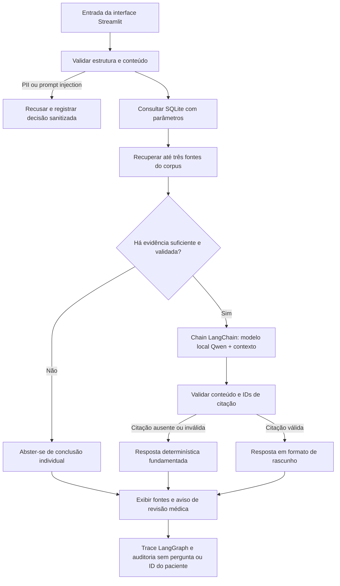

# Relatório técnico — Assistente de apoio à triagem SOP/PCOS

**Tech Challenge — Fase 3: IA Generativa**

**Versão:** final para entrega técnica

**Data de consolidação:** 15 de setembro de 2026

## Resumo

Este trabalho apresenta um protótipo acadêmico de apoio à organização de evidências relacionadas à síndrome dos ovários policísticos (SOP/PCOS). A solução combina um modelo Qwen 2.5 0.5B-Instruct ajustado por QLoRA, uma chain LangChain, orquestração LangGraph, consultas parametrizadas a uma base SQLite e recuperação lexical de fontes versionadas. O fluxo implementa controles de entrada, avaliação da suficiência das evidências, validação de citações e auditoria sanitizada.

O fine-tuning foi executado em GPU Tesla T4 com 600 exemplos instrucionais sintéticos, divididos em treino, validação e teste. A avaliação de recuperação abrangeu 44 perguntas. A comparação de geração reuniu 90 perguntas em três condições, totalizando 270 respostas. Os resultados indicam que o sistema rastreia registros e fontes e aplica abstinência quando não há evidência clínica validada suficiente; entretanto, as respostas brutas do modelo apresentaram baixa aderência a citações, razão pela qual o fluxo em produção acadêmica descarta saídas sem fonte rastreável e aciona uma resposta determinística fundamentada.

O protótipo tem finalidade didática e não foi validado para uso clínico. Os registros e dados de treinamento são sintéticos; as referências institucionais são identificadas por origem e edição, mas os resumos locais não passaram por revisão clínica e não sustentam decisões individuais.

## 1. Objetivo e aderência ao desafio

O enunciado solicita o ajuste de um modelo de linguagem para o domínio, a integração do modelo com dados estruturados por meio de LangChain, a organização de fluxos com LangGraph, salvaguardas, auditoria e rastreabilidade das fontes. Também solicita código modular com instruções de execução, relatório de avaliação e vídeo demonstrativo de até 15 minutos.

Como não foram fornecidos protocolos internos ou registros hospitalares para o projeto, a implementação utiliza exemplos sintéticos e referências institucionais públicas. Essa substituição permite demonstrar tecnicamente preparação de dados, ajuste, integração e controles sem apresentar conteúdo fictício como prontuário real. Os limites dessa escolha são considerados na análise dos resultados.

## 2. Dados e preparação

O conjunto de instruções contém 600 exemplos em português, gerados para este protótipo e particionados em 420 exemplos de treino, 90 de validação e 90 de teste. A preparação organiza pares de instrução e resposta no formato conversacional esperado pelo tokenizer do modelo. Durante o treinamento, o cálculo da perda é aplicado aos tokens da resposta do assistente, não aos tokens de sistema e usuário.

A base SQLite contém 12 registros de demonstração, sem identificadores pessoais. O corpus de recuperação contém nove itens: quatro notas internas de demonstração e cinco registros associados a fontes institucionais. As fontes externas têm emissor, edição, URL, data de conferência e escopo registrados no manifesto. Os textos locais são resumos concisos; cada um está marcado como não revisado clinicamente e inadequado para sustentar decisões individuais. O inventário e os links estão em [FONTES_CLINICAS.md](./FONTES_CLINICAS.md).

O portal do Ministério da Saúde disponibiliza o PCDT de SOP aprovado pela Portaria Conjunta nº 6/2019 e atualizado em catálogo posteriormente. As recomendações internacionais resumidas no corpus correspondem à publicação de 2023 hospedada pela ASRM. A referência Monash de 2026 está registrada para localização e consulta; seu PDF integral não foi incorporado nem resumido clinicamente. Portanto, a presença de uma referência institucional não deve ser confundida com validação profissional do respectivo resumo local.

## 3. Arquitetura e fluxo de execução



O grafo preserva a interface `run_triage()` e executa validação de entrada, consulta estruturada, recuperação, avaliação de evidências, geração, validação de segurança/citações e auditoria. A consulta SQL usa parâmetros e não recebe instruções do modelo. A chain LangChain carrega o adaptador local sob demanda quando disponível; nos testes, o modelo pode ser substituído por um gerador determinístico.

Pedidos sobre hipóteses diagnósticas, prescrições e doses são aceitos como solicitações de apoio à revisão médica. No estado atual, as fontes locais não possuem validação clínica e não sustentam conclusões individuais. Assim, o fluxo informa essa limitação e se abstém da conclusão clínica solicitada. Toda saída é identificada como rascunho sujeito à avaliação do médico responsável, que mantém a decisão final e medeia a comunicação ao paciente.

Quando o texto gerado não contém citação rastreável correspondente a uma fonte recuperada, o validador o descarta. O grafo então usa `grounded_fallback`, uma resposta determinística baseada nos dados e fontes disponíveis, e registra essa rota no trace. Essa alternativa preserva a rastreabilidade da aplicação, mas não corrige a aderência insuficiente do modelo bruto a citações.

## 4. Ajuste do modelo

O modelo-base foi `Qwen/Qwen2.5-0.5B-Instruct`. O treinamento utilizou QLoRA com quantização NF4 de 4 bits e dupla quantização, adaptador LoRA com rank 8, alpha 16, dropout 0,05 e projeções `q_proj`, `k_proj`, `v_proj` e `o_proj`. Foram usadas duas épocas, batch por dispositivo 1, acumulação de gradiente 8 e comprimento máximo de 1.024 tokens. O treinamento foi executado em GPU Tesla T4 no Google Colab.

O adaptador e o arquivo de resultados estão em `code/outputs/lora_adapter/`. O resumo registra 420/90/90 exemplos e perdas de 2,7671 no treino, 2,6078 na validação e 2,4071 no teste. A duração de treino registrada foi de aproximadamente 409 segundos. Essas perdas caracterizam a otimização sobre o conjunto sintético; não medem acurácia clínica, segurança ou capacidade diagnóstica.

## 5. Avaliação

### 5.1 Recuperação de fontes

O script `code/scripts/run_evaluation.py` avaliou 44 perguntas com recuperação lexical ponderada sobre texto, títulos e palavras-chave. As métricas são calculadas para os três primeiros resultados. Nos 20 casos acrescentados para testar referências institucionais, o documento esperado apareceu no top 3 em todos os casos.

| Métrica | Resultado | Interpretação |
|---|---:|---|
| Precision@3 | 0,326 | Em média, cerca de um dos três resultados é relevante. |
| Recall@3 | 0,943 | A maior parte das fontes esperadas aparece entre os três resultados. |
| MRR | 0,879 | A primeira fonte relevante tende a aparecer em posição alta. |
| Perguntas avaliadas | 44 | 24 casos anteriores e 20 casos sobre fontes institucionais. |

Os valores são indicadores de recuperação técnica para este conjunto pequeno e construído para o protótipo; não constituem validação clínica nem avaliam a correção médica dos resumos.

### 5.2 Geração de respostas

O arquivo `code/outputs/metrics/generation_comparison.jsonl` contém 90 perguntas de teste avaliadas em três condições: modelo-base sem RAG, LoRA sem RAG e LoRA com RAG. Foram analisadas 270 respostas. A verificação encontrou citação válida em 1/90 respostas do modelo-base e em 0/90 respostas nas duas condições LoRA.

| Condição | Fidelidade (1–5) | Completude (1–5) | Clareza (1–5) | Alertas críticos identificados | Citações válidas |
|---|---:|---:|---:|---:|---:|
| Modelo-base sem RAG | 2,07 | 2,58 | 2,08 | 14/90 | 1/90 |
| LoRA sem RAG | 2,01 | 2,51 | 4,31 | 4/90 | 0/90 |
| LoRA com RAG | 2,20 | 2,76 | 4,34 | 4/90 | 0/90 |

As pontuações são uma triagem preliminar baseada em rubrica estruturada, cobertura da resposta, legibilidade, citações e verificações de contradições críticas. Elas devem ser interpretadas como análise exploratória de engenharia, não como medição clínica, certificação de segurança ou revisão por profissional de saúde. A ausência de alerta detectado não demonstra que uma resposta seja segura. A rubrica detalhada por resposta está em `code/outputs/metrics/avaliacao_assistida_ia.json` e na aba correspondente da planilha `code/outputs/metrics/revisao_humana_geracao.xlsx`. Uma revisão manual adicional pode ampliar a análise, mas não é uma entrega explicitamente exigida pelo enunciado.

As respostas comparadas foram geradas com um snapshot anterior do corpus, composto pelas quatro notas sintéticas. As cinco referências institucionais foram incorporadas posteriormente e não fizeram parte do contexto dessas 270 gerações. A comparação, portanto, não mede o efeito dessas novas fontes.

Na inferência local, o Qwen carregou com o adaptador e executou pela chain do LangChain. No caso de fumaça registrado, a resposta gerada não apresentou citação rastreável; o grafo descartou o texto e retornou o resumo fundamentado do registro pelo caminho `grounded_fallback`. Esse comportamento confirma a operação do controle de citações no fluxo, ao mesmo tempo que evidencia a limitação das respostas brutas do adaptador.

## 6. Segurança, rastreabilidade e auditoria

- A validação bloqueia entradas com dados pessoais identificáveis e tentativas de prompt injection antes da consulta ao registro.
- O modelo não elabora SQL; as consultas SQLite são parametrizadas.
- Pedidos de diagnóstico, prescrição e dose são encaminhados como rascunhos para revisão médica. Sem fontes clinicamente validadas para uso individual, o sistema se abstém de conclusões.
- IDs citados devem corresponder a fontes recuperadas. Saídas sem citações válidas não são exibidas como respostas do modelo e seguem para a resposta fundamentada de contingência.
- O log registra identificador de execução, nó, decisão, IDs de fontes e latência. A pergunta e o identificador do paciente são omitidos.
- O exemplo didático de hipótese diagnóstica permanece separado do contexto da consulta e dos dados de treinamento.

Os controles foram exercitados por testes automatizados de software. Esses testes verificam comportamento programático; não equivalem a avaliação clínica ou validação para uso assistencial. A orientação de que a decisão clínica final cabe ao médico responsável também é consistente com a [Resolução CFM nº 2.454/2026](https://portal.cfm.org.br/noticias/regras-sobre-uso-da-ia-na-medicina-entram-em-vigor-no-dia-26-de-agosto/).

## 7. Verificação de software e reprodução

Na verificação local consolidada, os 48 testes automatizados passaram. Foram exercitados o grafo LangGraph, consultas parametrizadas, bloqueios de segurança, geração com substitutos determinísticos, recuperação, citações e auditoria. A avaliação de recuperação foi reexecutada sobre 44 casos e gerou `code/outputs/metrics/retrieval_metrics.json`. O app Streamlit e a inferência do adaptador também foram verificados em execuções separadas. O ambiente local utilizou Python 3.14; as dependências LangChain/Pydantic emitiram avisos de compatibilidade/depreciação, sem falha nos testes. Para reprodução, recomenda-se Python 3.12.

Com PowerShell aberto na raiz do repositório:

```powershell
Set-Location "Tech Challenge/Fase 3/code"
python -m venv .venv
.\.venv\Scripts\Activate.ps1
python -m pip install --upgrade pip
python -m pip install -r requirements-dev.txt
python -m pip install torch --index-url https://download.pytorch.org/whl/cpu
python -m pip install -r requirements-model.txt
python scripts/generate_synthetic_cases.py
python scripts/ingest_corpus.py
python scripts/generate_instruction_data.py
python -m pytest tests -q -p no:cacheprovider
python scripts/run_evaluation.py
python scripts/run_demo.py
python -m streamlit run app.py
```

O modelo-base é obtido do Hugging Face na primeira inferência, caso ainda não esteja em cache. Para repetir o treinamento QLoRA, gere o pacote com `python scripts/create_colab_bundle.py`, abra `docs/treinamento_colab.ipynb` no Google Colab, habilite uma GPU e execute as células. Para repetir a comparação de geração com o adaptador instalado, use `python scripts/run_generation_evaluation.py --limit 90`; para gerar novamente a rubrica, use `python scripts/evaluate_ai_review.py`.

## 8. Limitações e conclusão

O protótipo atende tecnicamente aos componentes de ajuste, integração LangChain, orquestração LangGraph, consulta estruturada, controles e auditoria solicitados. As principais limitações observadas são o uso de dados sintéticos em lugar de dados internos hospitalares, o corpus reduzido, o recuperador lexical, os resumos locais sem revisão clínica e a baixa incidência de citações válidas nas respostas brutas do modelo. A contingência rastreável reduz a exposição a saídas sem fonte, mas não demonstra eficácia clínica.

A avaliação não autoriza uso assistencial. Para esta entrega, os artefatos técnicos — código, dados de demonstração, resultados, README e relatório — estão organizados no repositório. A única entrega solicitada pelo enunciado que ainda depende de ação fora desses artefatos é a gravação e conferência do vídeo demonstrativo, que deve respeitar o limite de 15 minutos. O roteiro correspondente está em [ROTEIRO_VIDEO.md](./ROTEIRO_VIDEO.md).
